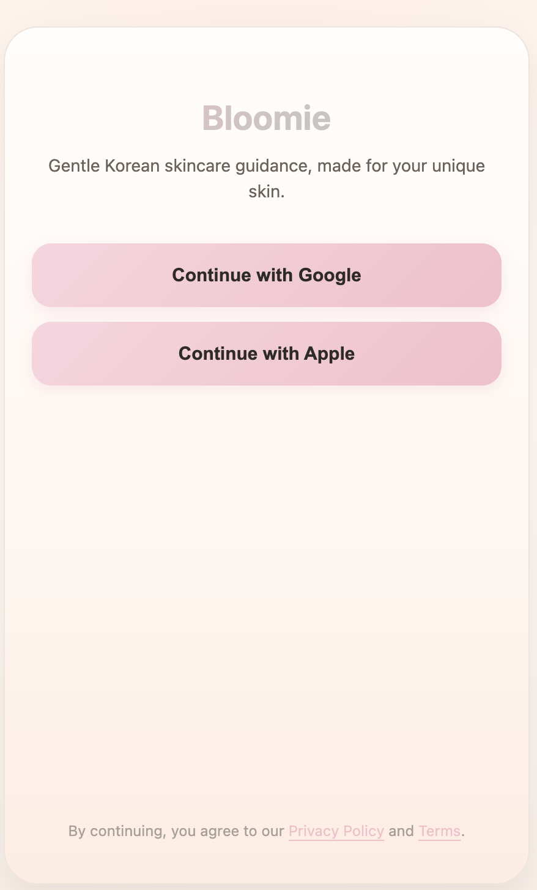
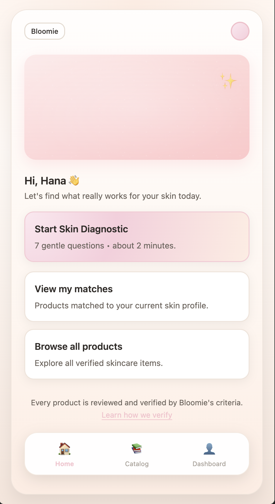
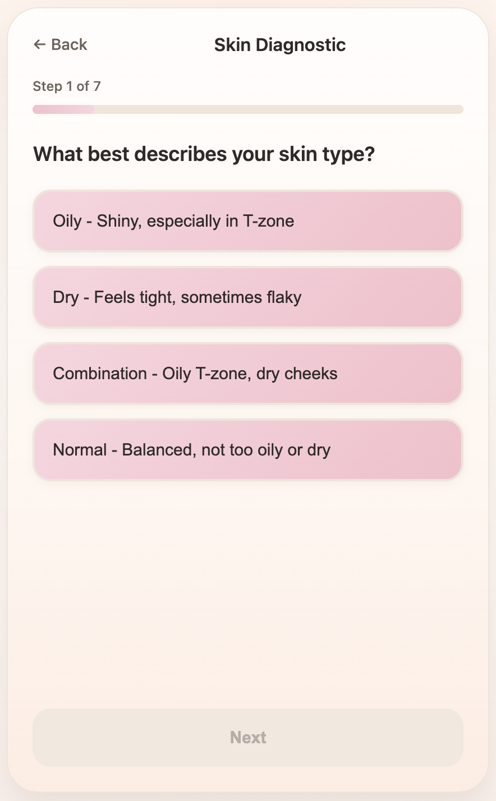
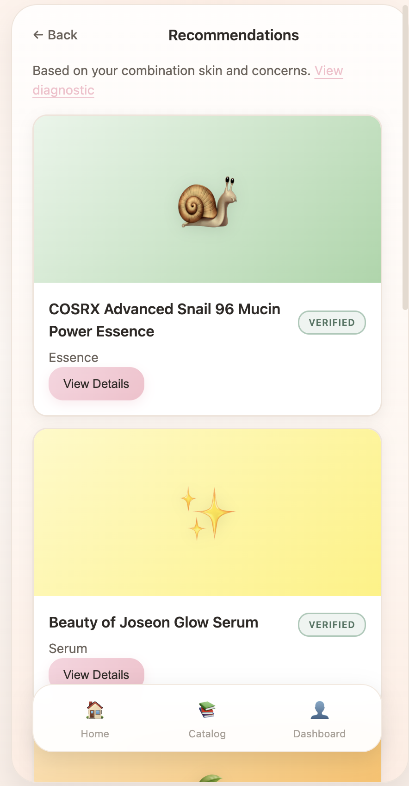

# Bloomie 🌸

**Gentle Korean skincare guidance, made for your unique skin.**

Bloomie is a mobile-first web app concept that walks a user through a short skin
diagnostic and returns a personalized skin profile plus rule-based recommendations
from a catalog of verified K-beauty products. It was built as a university project
to practice product thinking end to end — spec, wireframes, data model, and a
working front-end prototype.

🔗 **Live demo:** https://keeper24.github.io/bloomie_app/

> **Note:** This is a front-end prototype. Social login is mocked, and the product
> catalog and recommendations run entirely in the browser against local sample data
> (`js/data.js`). No backend, no accounts, no data leaves your device — the "profile"
> and favorites are saved in `localStorage`.

---

## Demo

**Screens:**

| Login | Home | Diagnostic | Result |
| --- | --- | --- | --- |
|  |  |  |  |

---

## Features

- **Social login screen** (Google / Apple) — mocked entry point.
- **7-question skin diagnostic** with a progress bar and per-step validation.
- **Skin profile result** — derived skin type, key concerns, and a plain-language explanation.
- **Rule-based recommendations** matched to the user's skin type and concerns.
- **Verified product catalog** with product detail (description, collapsible ingredients, suitability).
- **Favorites** saved across sessions via `localStorage`.
- **Dashboard** summarizing the skin profile and saved products.
- **Settings** with consent/privacy info, data export (JSON / CSV), and account deletion.
- **Responsive, mobile-first UI** with a soft blush-and-sage design system.

## Tech stack

Plain **HTML, CSS, and vanilla JavaScript** — no framework, no build step. The app
is a small client-side screen router; content is separated from behaviour so the
UI logic stays readable.

## Project structure

```
bloomie/
├── index.html          # All screens (markup only)
├── css/
│   └── style.css       # Design system + component styles
├── js/
│   ├── data.js         # Questions, results, and product catalog (sample data)
│   └── app.js          # Screen router + diagnostic / catalog / favorites logic
├── docs/               # Product spec, architecture, data schema, backlog, wireframes
└── assets/             # Screenshots and demo media
```

## Run locally

No dependencies or build tooling. Because the app loads JS modules over HTTP,
serve the folder rather than opening the file directly:

```bash
# from the project root
python3 -m http.server 8000
# then open http://localhost:8000
```

Any static server works (`npx serve`, VS Code Live Server, etc.).

## Documentation

The planning artifacts from the project live in [`docs/`](docs/):

- [SPEC.md](docs/SPEC.md) — MVP scope (MoSCoW), navigation, and flows
- [ARCHITECTURE.md](docs/ARCHITECTURE.md) — high-level system design + diagram
- [DATA_SCHEMA.md](docs/DATA_SCHEMA.md) — entities, relationships, and constraints
- [BACKLOG.md](docs/BACKLOG.md) — epics and user stories
- [wireframes.md](docs/wireframes.md) — low-fidelity wireframes

## Roadmap

Ideas intentionally left out of the MVP (see the backlog for detail):

- Real social authentication and a REST backend
- Working catalog filters (skin type, concern, category)
- AM/PM routine suggestions
- Analytics events and post-diagnostic email

## Disclaimer

Bloomie is an educational prototype. Product names are real K-beauty items used as
sample data; the "verified" badge and recommendations are illustrative and are **not**
professional skincare or medical advice.

## Author

Built by [@keeper24](https://github.com/keeper24) as a university project.
